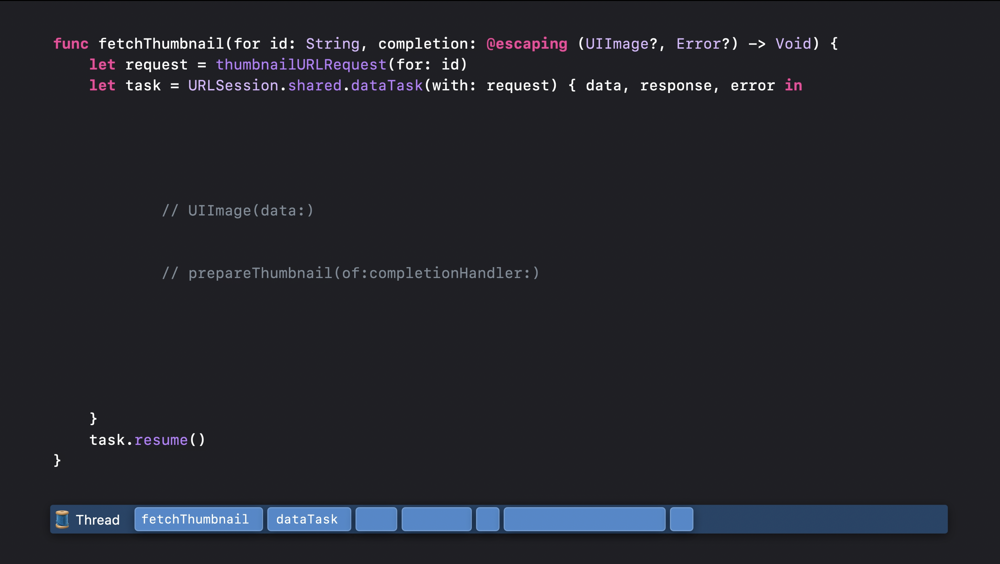
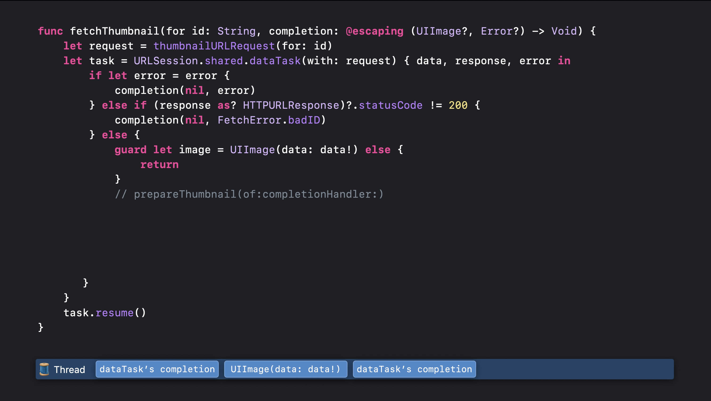
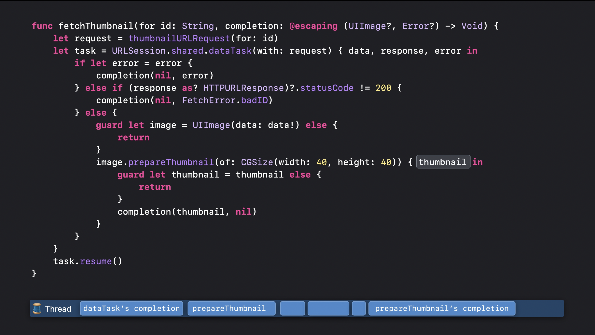

# Async Await
- escaping보다 안전하게 **비동기 처리를 할 수 있는 메서드**
- 처리해야되는 순서대로 코드 작성이 가능하다.
- 비동기와 동기 메서드를 함께 실행할 수 있게 된다. 
- 각 과정이 실행된 이후, 발생한 에러 혹은 결과값을 항상 알린다. > return 혹은 errorHandling을 하게 된다.
- 메서드 뿐만 아니라 프로퍼티 또한 비동기가 가능하다.

- async 메서드에 '임시 정지' 기능을 부여한다. 따라서 call site에서 또한 async를 활용해야한다.
- **비동기 작업이 이뤄질 가능성이 있는 경우, await 키워드를 사용하도록 권장한다**.<br/>
*다른 작업을 먼저 실행할 수 있다는 점을 알려야하기 때문*
- 시스템에서 다른 행동을 취할 수 있게 된다.
- async를 적용하면서 메서드 이름또한 변경되게 된다. 비동기 처리가 진행되기에 get 같은 동기적 명칭은 안 어울리게 된다.

## 사용 예시
```swift
// async throws로 비동기 메서드임을 알린다.
// 리턴 값은 Pokemon만 받으며 Error가 발생할 경우 throws로 던질 예정임만 알림.
func fetchPokemon() async throws -> Pokemon {
    let endpoint = "some end point URL"
    guard let url = URL(string: endPoint) else {
        // 에러 처리
        throw NetworkError.invalidURL
    }
    
    // try는 @escaping에 사용되었던 completionHandler와 같은 역할을 하게 된다.
    // await로 동기 메서드가 스레드를 막지 않게 된다.
    let (data, response) = try await URLSession.shared.data(from: url)
    guard let response = response as? HTTPURLResponse, response.statusCode == 200 else {
        // 에러 처리
        throw NetworkError.invalidResponse
    }
    
    // do, try, catch로 마지막 data를 변환하는 과정을 거친다.
    do {
        return try decoder.decode(Pokemon.self, from: data)
    } catch {
        throw NetworkError.invalidDataFormat
    }
}
```

동기로 진행할 경우 - 다른 코드는 멈추게 된다.
- escaping을 통해 통신이나 메서드가 종료되었다는 점을 알린다. - completionHandler
- 간혹 API 콜 내부의 메서드가 빨리 끝나는 경우가 존재한다. url을 변환하는 과정이나 이미지 데이터를 변환하기만 하는 경우 빨리 처리가 가능한데, 이런 경우는 thread가 백그라운드에서 실행이 되어도 문제가 없다. 반대로 시간이 걸리는 메서드의 경우 - 비동기처리롤 메서드를 실행한다.
- 전체적인 메서드 흐름은 순서대로 실행이 되어야 한다.
- 기존 방식은 escaping을 통해 처리를 했다.






## Escaping의 문제점
1. 오류를 호출하는 것을 잊어버릴 수 있다.
- 이럴 경우, 사용자는 UI 업데이트 혹은 안내 없이 계속해서 빈 이미지를 맞이하게 된다. > 따라서 오류가 났을 때에도 문제점을 알리는 것은 중요하다!

- 하지만 이 상황의 경우 Swift에서 권장하는 에러 처리를 할 수 없다고 한다. 문제를 마주했을 때 에러를 던질 수 없다는 점인데, 클로저로 처리가 되기 때문에, 우리는 오류를 원했음에도 처리가 안된다는 점.
- 이미지를 받기 위해 실행해야 했던 4가지의 메서드 (2개 비동기, 2개 동기)를 위해 5개의 오류 처리를 해야한다. > 원하는 기능을 구현할 수 있었지만, 이해하기 어려웠고 의도를 파악하기 어렵다는 점 

### Possible Solution

- Result를 통해 더 안전한 처리가 가능하지만 코드 길이 자체는 늘어난다.

## 공식문서의 추가 안내(동기 vs 비동기)

- 메서드를 실행하면 결과값 또는 오류를 반환할 떄까지 스레드는 일시적으로 멈추게 된다.<br.> 즉, 스레드의 권한은 해당 메서드로 넘어가게 된다. 여기서 스레드의 권한을 돌려받기 위해선 해당 메서드가 오류를 뱉거나 결과값을 리턴해야한다.


- 비동기(asynchronous) 작업은 반대로 해당 작업이 진행하는 동안 스레드의 권한을 메서드가 아닌 시스템으로 넘긴다. 중요한 일을 먼저 처리할 수 있도록 시스템에게 권한을 넘기게 된 것인데, 시스템은 임시 멈춰진 비동기 메서드로 다시 돌아와 실행하게 된다.
- 여기 특징은 반복해서 멈출 수 있다는 점. 횟수의 제한이 없기에 계속해서 멈출 수 있게 된다.
- Async 키워드를 활용했다고 비동기적으로 메서드를 실행하지는 않는다.
Await도 마찬가지.

## 비동기 처리 과정

- fetchThumbnail 메서드가 호출된 이후, 유저가 데이터에 변화를 주는 행동을 하게 될 경우, URLSession 작업은 임시로 멈춰지며 데이터 변경 작업을 먼저 실행하게 된다.
- 이후 시스템은 fetchThumbnail 메서드로 돌아가거나 다른 메서드를 실행할 수 있게 된다. 더불어 의도했던 스레드가 아닌 곳에서 실행 될 수 있다.
- **따라서 Swift에서는 await 키워드를 활용하도록 권장하는 것.**
[Thread Safety and Async/Await]

## sync 메서드에 async 메서드 처리 방법
```swift
private func fetchData() {
    // Task없이는 비동기처리 작업을 할 수 없다.
    // Task {
        do {
            let pokemonData = try await NetworkManager.shared.fetchPokemon()
            PersistenceManager.shared.savePokeData(pokemonData.id)
            self.pokemonName = pokemonData.name
            self.setImage(with: pokemonData)
        } catch let error {
            if let error = error as? NetworkError {
                print("네트워크 오류가 발생했습니다.")
            } else {
                print("예측 불가능한 에러가 발생했어요.")
            }
        }
    //}
}
```
일반 메서드는 동기적으로(synchronous) 처리를 하기 때문에 비동기 처리(asynchronous)를 하는 fetchPokemon 메서드를 내부에서 실행할 수 없다. 이를 실행하기 위해선 Task 라는 비동기 처리에 감싸야 한다.

### Updates after 5.5
- 컴파일러는 이제 자동적으로 completionHandler를 확인한 이후 Async await 대체안을 적용할 수 있게 됐다.

### async Alternative && Continuation [🚧 추가 공부 중]
```swift
// 이전 메서드
func getPersistentPosts(completion: @escaping ([Post], Error?) -> Void) {
    do {
        let req = Post.fetchRequest()
        req.sortDescriptors = [ NSSortDescriptor(key: "date"), ascending: true) ]
        let asyncRequest = NSAsynchronousFetchRequest<Post>(fetchRequest: req) { result in
        completion(result.finalResult ?? [], nil)
        }

        try self.managedObjectContext.execute(asyncRequest)
    } catch {
        completion([], error)
    }
}

// async 적용 > continuation
func persistentPost() asycn throws -> [Post] {
    typeAlias PostContinuation = CheckedContinuation<[Post], Error>
    return try await withCheckedThrowingContinuation { (continuation: PostContinuation in
    self.getPersistentPosts { posts, error in
        continuation.resume(throwing: error)
    } else {
        continutation.resume(returning: posts)
    }
    )}
}
```

- 우리는 await를 통해 권한을 시스템으로 넘기고 결과값이 돌아오기를 기다리며 클로저를 통해 어떤 작업이 이뤄져야하는지 알린다. 메서드가 실행된 이후, completion block을 통해 우리는 해당 결과값을 자유롭게 던질 수 있게 되는데 이를 continuation이라 부른다.
- continuation은 한번만 호출되어야 한다.

### Question
- escaping로 호출하는 URLSession은 동기인가 비동기인가?
- What is considered important?
- 계속해서 딜레이가 발생한다면 계속해서 멈춰질 가능성이 있을까?