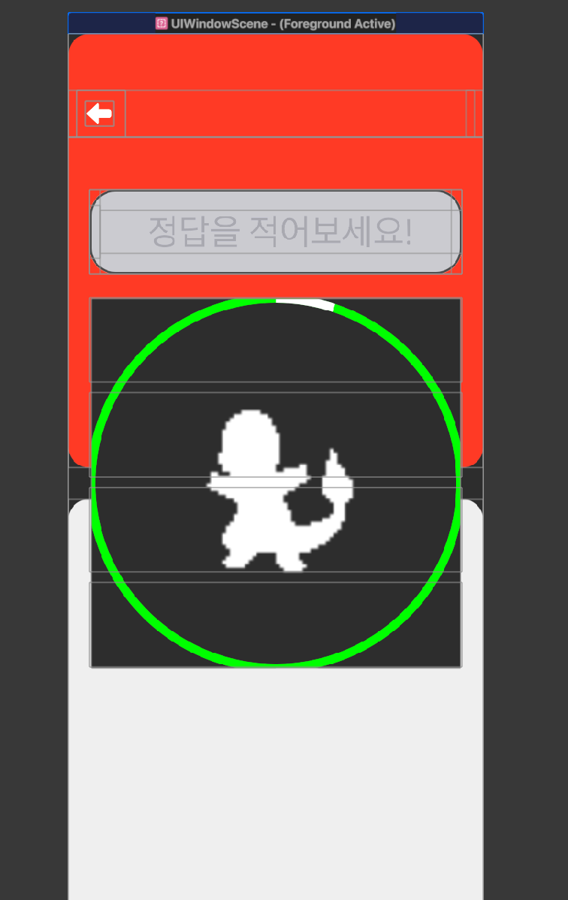
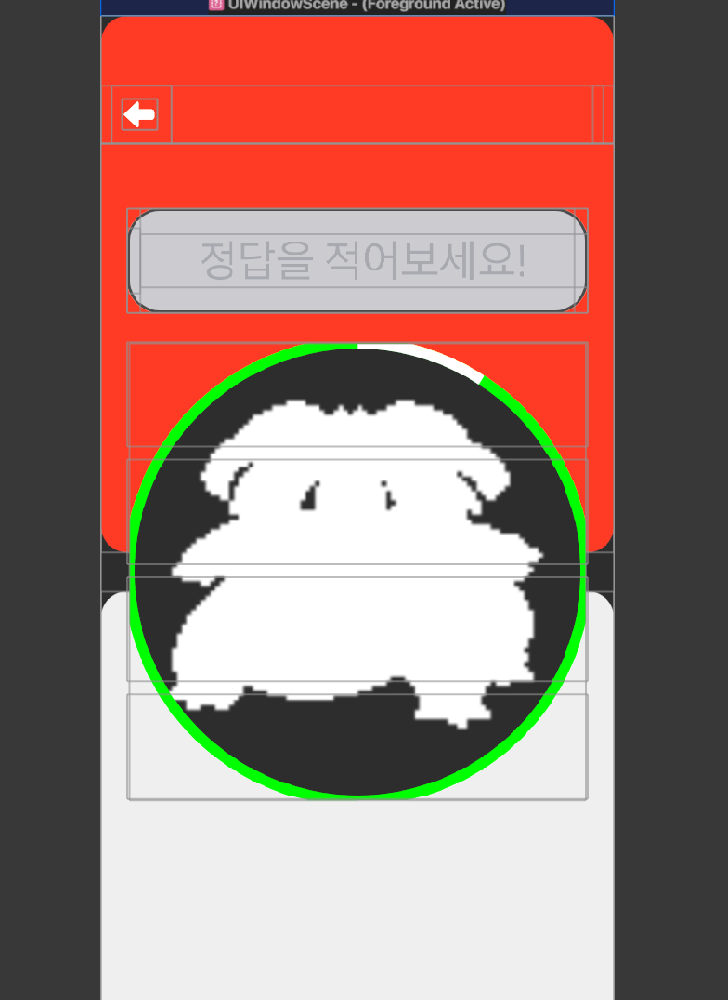

# Frame vs Bounds

> ## Frame vs Bounds

frame과 bound에 대해서 예전에 정리했던 자료가 있지만, 업데이트 하면서 정리를 해본다.
frame은 말 그대로 어떤 벽에 붙은 액자 같은 친구이다.
액자가 걸려 있는 벽(superview)를 기준으로 view의 사이즈와 위치를 제공한다.
따라서 액자가 걸려 있는 좌표와 위치가 크기가 다른 벽에 걸리면 이미지는 계속해서 바뀌게 된다.
반대로 bounds는 자기 관점에서 크기를 지정하기에 autolayout으로 컴포넌트 배치를하게 된 지금, 가장 많이 활용되는 프로퍼티가 아닐까 싶다.
 

### Frame과 Bound 차이점

차이점이 보이는가?

컴포넌트를 그리는 시작점은 좌측 상단으로 둘 다 동일.
하지만 frame은 벽(superview)에서 어디쯤 위치해있는지 (x,y 좌표)가 중요.
반대로 bound는 point를 활용해서 크기를 키우기에 x, y좌표는 항상 0,0이라 볼 수 있다.
 

### cornerRadius를 적용하면...

둘 다 layer.cornerRadius = self.frame(bounds).width/2를 적용한 상황.
frame은 자신이 생성되는 callSite에서 지정해준 frame의 크기가 없기에 cornerRadius 값이 없는 것과 마찬가지인 것. 반대로 bounds의 경우, callSite에서 비록 frame 값을 주지 않았지만, 오토레이아웃으로 컴포넌트 크기를 지정해주었다.