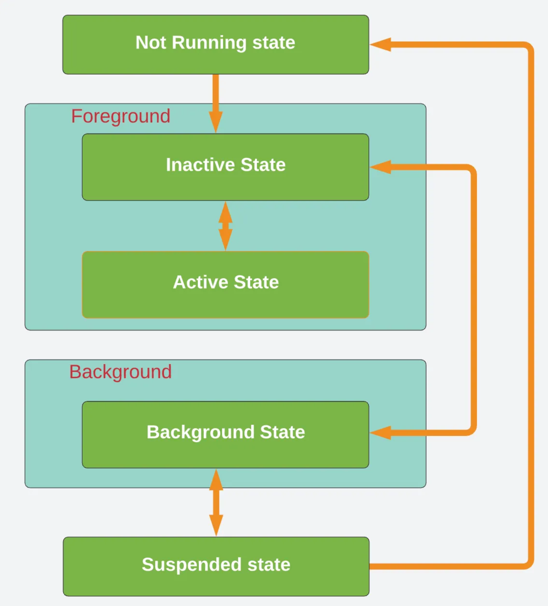

# LifeCycleManagement
#### 🚨상시 정리 중🚨

## 화면 구성
- The users are unable to perceieve the change or a layout update when they initiate the interaction with an app. Thus, we can confirm that applications operates around 60fps, which defines an event occurs 1/60 frames per second in an iPhone.

#### *Q. is 60fps the lowest point to users being imperceptive to UIView layout?*

## Application Life cycle in iOS

### What is a life cycle?
- it is a cycle of sequence of events that happens in between launch and termination of an application.

### SpringBoard
- When the user taps on an app, the springboard launches the app.
It is the standard application that manages iPhone's home screen.

- It is important to understand that when springboard is animating the chosen app's launch screen,
the app will be loaded into memory along with necessary libararies.
After the app is finished launching, the application delegate will become ready to recieve notifications.

### App Delegate
- An Application delegate object.
Inherits UIResonder class and uses UIApplicationDelegate delegate protocol.

### UIApplicationDelegate delegate protocol
- The UIApplication Delegate delegate is the "main entry point"  for iOS apps.  It is required to get notifications of user events such as taps, app launch, app going into background/foreground etc.
Enables AppDelegate to be application delegate object to manage the life cycle of an app. 

### UIResponder
- UIResponder class gives the appDelegate the ability to respond to user events.
 

### 5 states for Apps

1. **Not-running State:** App isn't launched or terminated
2. **Inactive State:** App is entering foreground state, but not recieving events
3. **Active State:** App has entered foreground and is recieving events
4. **Background State:** If there is an executable code, it executes - but after finishing running / no executable code, application will be suspended Immediately.
5. **Suspended State:** app is in background(memory) but not executing code & will be terminated if device has not enough memory.

#### *Q. Inactive, Background, Suspended state의 차이점은 무엇일까?*
- inactive는 어플을 종료할 때 호출되는 시점으로 종료되고 있는 단계로 보인다. 반면 background는 어플이 화면에서 보이지 않아 종료된 것으로 보이지만, 메모리상에는 존재하며 특정 이벤트(알람?)이 발생하지 않는 이상 잠자는 단계인 것으로 보인다. (화산이 dormant한 상황과 비슷하다고 할까...) Suspended state는 앞서 background state처럼 완전히 종료되지는 않았지만 별도로 event가 발생하고 있지 않는 상황을 의미하는 것 같다.

#### Q2. 시스템이 Suspend state를 어떻게 알 수 있을까? 사용자가 어플을 종료하지 않으면 해당 state에서 나갈 수 있는 방법은 없는건가?
- 쉽게 이해하면 suspended 상황은 어플이 실행되지 않으며 어떤 알람 또는 이벤트를 받지 않는 상황으로 보인다. 그렇다면 해당 상황에 처한 어플은 1. 실행이 되거나 2. 시스템 메모리가 부족해져 강제로 실행 종료를 하지 않는 이상 suspended state를 벗어날 수 있는 방법이 없는건가??

## Main
- 어플에서 발생하는 사용자와 연관된 모든 이벤트를 처리한다.
- 실행(launch time)에 main run loop이 app delegate에 의해 실행된다.
- main 쓰레드는 다중 쓰레드로 사용자가 입력하는 이벤트를 차례대로 실행할 수 있도록 돕는다.

### 참고
- https://manasaprema04.medium.com/application-life-cycle-in-ios-f7365d8c1636