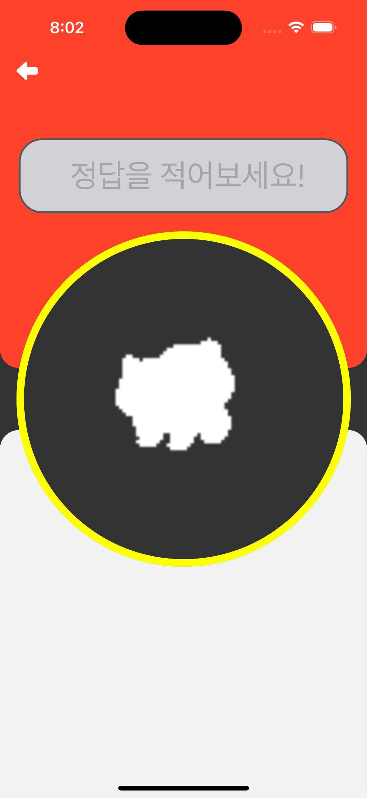
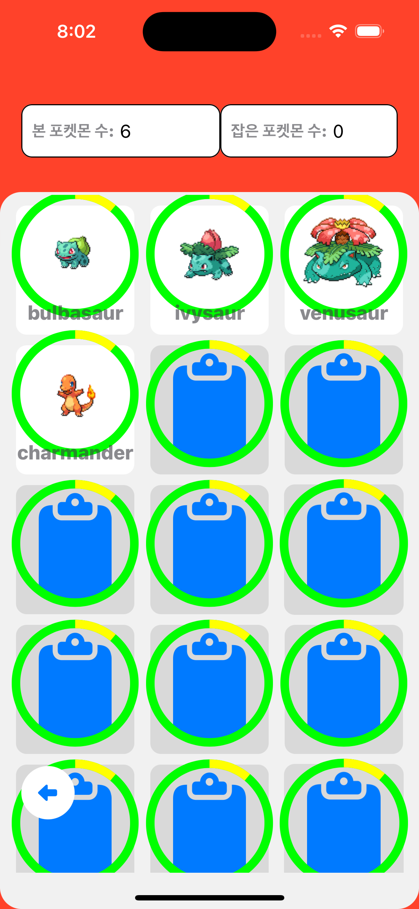

# UIBezierPath

> ## 타이머 시각화

### 🥚 Breakdown
1. 타이머 layer 구현
2. reduce layer 구현
3. 시간이 지날수록 reduceLayer이 떨어지는 모션 구현
4. reduceLayer이 0에 도달하는 순간 VC에서 알람 안내

### 🐣 생각 정리
- layer는 어떻게 구현할 수 있을까?
- 이미 있는 ImageView에 추가해도 좋은 방법일까?
- 발생할 수 있는 문제점은 무엇이 있을까?

## 🐔 접근 시도

### 1. UIBezierPath로 Arc 생성
StackOverflow에서 UIBezierPath가 사용되는 점을 확인, 공식 문서를 읽어 구현 시도

```swift
let path = UIBezierPath()
path.addArc(
    withCenter: CGPoint(
        x: bounds.midX,
        y: bounds.midY),
        radius: bounds.width/2,
        startAngle: 0,
        endAngle: 360,
        clockwise: true)
```
첫 코드로 어떤 변화가 없다는 것을 보며 UIBezierPath만으로 구현이 안되는 점을 깨닳음. 말그대로 **패스만** 설정할 뿐, 직접적인 변화는 레이어에 해야한다는 점.
<br/>

### 2. CAShapeLayer에 적용
```swift
let timeShapeLayer = CAShapeLayer()

func drawShape() {
    timeShapeLayer.path = UIBezierPath(
        arcCenter: CGPoint(
            x: frame.width, y: frame.height),
            radius: bounds.width/2,
            startAngle: -270.degreesToRadians,
            endAngle: 90.degreesToRadians,
            clockwise: true
        ).cgPath
    
    // 생성한 layer의 세부 설정
    timeShapeLayer.fillColor = UIColor.white.cgColor
    timeShapeLayer.strokeColor = UIColor.blue.cgColor
    timeShapeLayer.lineWidth = 2

    // 서브 레이어로 추가
    layer.addSublayer(timeShapeLayer)
}
```
레이어에 원하는 크기의 원형 path를 추가.<br/>
startAngle, endAngle을 공식문서 설명대로 'angle'로 이해하는 바람에 0과 360도를 작성했다. 엄청난 결과물을 확인한 이후, stackOverflow 도움으로 radian으로 변환 값 적용. (추후 추가 정리)

### 3. UIImageView 생성 시, 바로 적용

```swift
    override func layoutSubviews() {
        super.layoutSubviews()
        
        let path = UIBezierPath()
        path.addArc(withCenter: CGPoint(x: bounds.midX, y: bounds.midY),
                    radius: bounds.width/2,
                    startAngle: -90.degreesToRadians,
                    endAngle: 270.degreesToRadians,
                    clockwise: true)
        
        timeLeftShapeLayer.path = path.cgPath
        timeShapeLayer.path = path.cgPath
    }
```
이미지가 생성되자마자 바로 구현될 수 있는 방법이 무엇이 있을지 생각했다.

#### 마주한 문제



collectionview에서는 잘 로딩되고 있었지만, 하나의 이미지만 가지고 있던 screen에서는 path가 움직이지 않고 있었다.
아직 명확한 답이 없지만, 친구들과 고민해 본 결과 **dispatchQueue.main 쓰레드에서 view를 호출하고 있다보니 겹쳐지고 있는 문제가 아닌지 결론을 내렸다.**

```swift
private func setImage(with data: Pokemon) {
    NetworkManager.shared.downloadImage(from: data.sprites.frontDefault) { [weak self] image in
    guard let self = self else { return }
    guard let image = image else { return }
    DispatchQueue.main.async {
        let imageStroke = image.createSilhouette()
        self.pokeImageview.image = imageStroke
        self.pokeImageview.contentMode = .scaleAspectFit
        }
    }
}
```
네트워크에서 이미지를 다운받고 있는 시점에 UIImageView에서 CAShapeLayer가 먼저 실행되고, 이미지를 모두 받은 이후 UIImageView의 이미지를 교체하게 되면서 기존에 적용했던 CAShapeLayer가 교체되어 적용되는 것으로 이해된다.