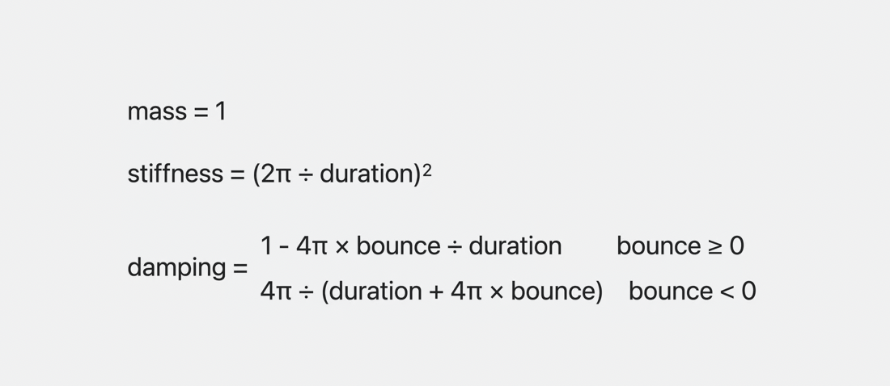

# WWDC19 - Optimizing App Launch

animation gives continuity
feels more natural to see an object move from 1 point to next

if velocity changes, doesn't' feel right.

### 1.Ease in and out
- no jump in velocity, constant

### 2. Linear
- a jump in velocity (be cautious)
- non physical behavior is present

### 3. Spring
- looks the best, but only on point one.


Ease and out jerks to halt as animation ends.
no initial velocity


Spring has any velocity


### Shape of motion

- bounce 와 duration을 적용하면 된다.
(>, 0%, < -100%) bounce를 활용할 수 있다.
bouncy, smooth, flattened

- bounce value가 0%, 0%보다 크거나, 0%보다 작을 경우 사용하는 표현이 있다.
Underdamped, Critically Damped, Overdamped 라고 서술한다!

velocity Preservation


mass
stiffness - spring
damping - how much friction is given to the object

초기 위치에서 목적 위치로 이동할 때 animation이 작동된다.

## Spring Duration
settling duration & perceptual duration
- 일반적으로 duration은 변화가 인지되는 시점을 뜻한다.
반면, Settling duration은 duration과 달리 여러 요소들을 고려한 시점을 뜻하기 때문에 언제 끝날지 예상을 할 수가 없다.
따라서 어플에서 animation 혹은 transition이 끝났다고 사용자가 인식할 때 다른 동작을 하기를 위해선,
completion을 활용하여 settling duration 시점이 아닌 perceptual duration (인지하는) 시점을 활용하는 것이 좋다.


# How to use Spring
spring은 SwiftUI에 기본적으로 제공을 한다.
```swift
withAnimation {
    isActive.toggle()
}
```

// 기본으로 smooth, snappy, bouncy가 적용되어 있다.
```swift
withAnimation(.snappy(duration:0.4, extraBounce: 0.1)) {
    isActive.toggle()
}

// Custom Spring
withAnimation(.spring(duration: 0.6, bounce: 0.2)) {
    isActive.toggle()
}

// UIKit
UIView.animate(duration: 0.6, bounce: 0.2) {
    // extra code
}

// 더 나아가 Spring Model 활용
let otherSpring = Spring(mass: 1, stiffness: 100, damping: 10)
withAnimation(.spring(otherSpring)) {
    isActive.toggle()
}

// Custom Spring Animation
func animate<V: VectorArithmetic>(value: V, time: Double, context: inout AnimationContext<V>) -> V? {
        spring.value(
            target: value,
            initialVelocity: context.initialVelocity,
            time: effectiveTime(time: time, context: context)
        )
}

```

혹은, 아래 공식으로 직접 Spring Animation을 구성할 수 있다.



### Spring Parameters
모를 때는 0을 활용하고 bounce가 40% 이상을 넘어가면 애매해진다.
어플의 분위기에 따라 그 이상을 적용하거나 적게 적용하는 것도 방법이다! (what's the app's feeling?)


