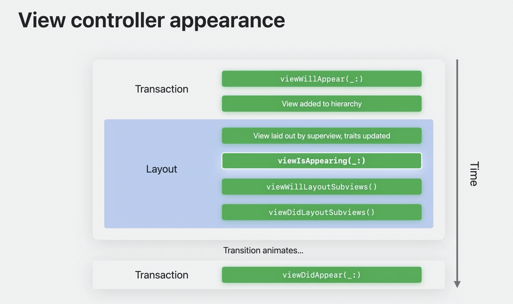

# UIKit Update

## A. Key Features
### 1. Xcode Previews
- preview is not available directly using #preview macros
```swift
class SlideshowView: UIView {
    #Preview("Memories") {
        let view = SlideshowView()
        view.title = "Memories"
        view.subtitle = "Highlights from past year"
        view.image = testImage.image
        return view
    }
}
```

### 2. viewController Lifecycle update
- when preseting viewController or pushing or popping, viewisAppearing is now here.
- called between viewWillAppear and viewDidAppear.
- THE BEST moment to update UI when view appears.


- 시점이 새로 생긴 이유는 위 시점들을 보면 이해할 수 있다.
자주 사용되는 viewWillAppear과 viewDidAppear는 각각 view가 hierarchy 위로 올라가기 전, 혹은 animation/transition이 종료된 이후에 활용되는 시점이다.
- 더불어 view의 subview들의 위치가 잡힐것이라고 안내하는 시점인 viewWillLayoutSubviews와 viewDidLayoutSubviews는 반복적으로 호출될 가능성이 있다. addsubview가 반복되거나 scrolling이 가능해질 때 여러번 호출될 수 있는 시점이 layoutSubview이기에 단 한번만 view가 hierarchy에 더해지고, transition이 이루어지는 시점에 새로운 변화를 업데이트 한번만 호출할 수 있는 최적의 시점이 viewIsAppearing이라는 이야기.

추가 참고
- https://stackoverflow.com/questions/13446920/how-can-i-get-a-views-current-width-and-height-when-using-autolayout-constraint/13542580#13542580
- https://stackoverflow.com/questions/728372/when-is-layoutsubviews-called

### 3. Trait System enhancement
이해가 잘 안된다!

### 4. animated Symbol images
- Symbols Effects API를 활용해서 이제 symbol들은 animation이 제공된다.
- Effect들은 어떤 Symbol들에 적용이 된다
```swift
// bounce effect - single bounce
imageView.addSymbolEffects(.bounce)

// variable color effect - repeatable
imageView.addSymbolEffects(.variableColor.iterative)

// & remove the color effect to end
imageView.removeSymbolEffects(ofType: .variableColor)

// change image with transition animation
imageView.setSymbolImage(pauseImage, contentTransition: .replace.offUp)
```

### 5. Empty States
- Moments in app when there is no content in display
- Occurs when the view can't load content due to limitation or when the app first launches.
```swift
// empty state placeholder
var config = UIContentUnavailableConfiguration.empty()
config.image = UIImage(systemName: "star.fill")
config.text = "No favorites"
config.secondaryText = "Your favorite Translation will appear here"
viewcontroller.contentUnavailableConfiguration = config

// empty state - loading
var config = UIContentUnavailableConfiguration.loading()
viewController.contentUnavailableConfiguration = config

// present using SwiftUI view
let config = UIHostingConfiguration {
    VStack {
        ProgressView(value: progress)
        Text("Downloading Image")
        .foregroundStyle(.secondary)
    }
}
viewcontroller.contentUnavailableConfiguration = config
```

// contentUnavailableConfiguration 관련해서는 추가 코드 확인

## Internationalization
### Dynamic line-height adjustment
- 각 나라별 단어를 표기할 때 하단과 상단을 표기하는 x line(?)과 base line이 존재한다.
- 영어 외에도 태국어, 아랍어 등에서는 base line과 x line을 넘는 경우가 많이 발생한다.
이는 optimal language height가 없도록 만드는데, 이를 해소하고자 UILabel 등에 모든 언어를 위한 최적의 높이 및 기준을 세울 수 있도록 Dynamic line height adjustment를 적용했다는 점

이외에도 wrapping and hyphenation을 적용하였다고~

## Ipad Improvements
### window dragging interaction
- 윈도우를 드래그를 하기 위해 navigationbar 뿐만 아니라 어떠한 screen의 공간을 잡아도 드래그가 가능해졌다

### sidebar behavior
- 어플 또는 window가 특정 크기가 되기 전까지 sidebar은 앞으로 자동적으로 사라진다.
- sidebar을 활용할 경우, overlay 형태로 등장하며 해당 overlay는 window 크기를 키우거나 줄일 때에도 지속된다.
이후, 특정 크기가 되었을 때 sidebar을 화면에서 내렸다가 다시 호출하는 경우, 초기 모습처럼 sidebar이 overlay가 아닌 push 형식으로 등장한다.

### document improvement
이해가 잘 안된다!

## General Enhancements
### 1. CollectionView performance
- large number item sorting or deleting performance speed increase

Layout enhancement
- allows sibling cells to match their heights even when cells have fewer data or contents within.
```swift
NSCollectionLayouDimension.uniformAcrossSibling(estimate:)
```

### 2. Spring animation
- duration과 bounce를 활용해서 spring animation을 적용할 수 있다.
여기서 중점은 duration은 animation이 **완료되기까지 걸리는 시점이 아닌, animation이 끝났다고 인식하게 되는 시간**인 점.

### 3. text interactions
이해가 잘 안된다!

### 4. Default status bar style
- 앞으로 default는 light, dark mode에 따라 색을 유지하지 않고 content에 따라 status bar의 색상이 바뀐다.
- 필요에 따라 색상이 서로 반전되기도 한다고~

### drag and drop
- url 링크 등을 드래그해서 필요한/원하는 어플에 드롭을 할 경우, 실행이 가능해진다고 한다.
예) URL Link를 드래그해서 Safari에 드롭할 경우, 열리게 된다!

### ISO HDR Image Support
이해가 잘 안된다!

### UIPageControl
- page control에 시간을 알리는 duration bar가 생겼다.
```swift
// 각 페이지별 타이머가 생기게 된다!
let timerProgress = UIPageControlTimerProgress(preferredDuration: 10)
pageControl.progress = timerProgress

timerProgress.resumeTimer()
```

### PaletteMenus
이해가 잘 안된다!
