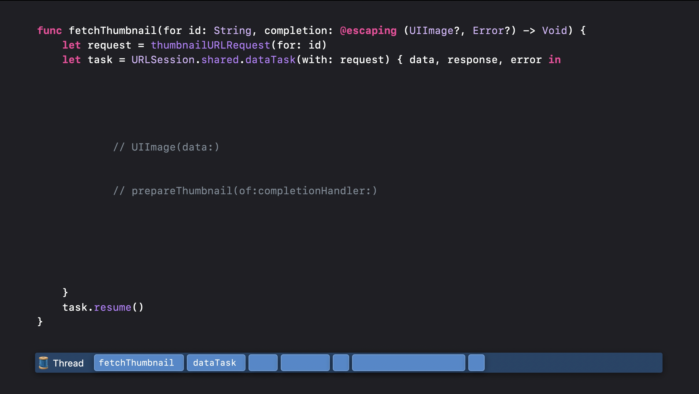
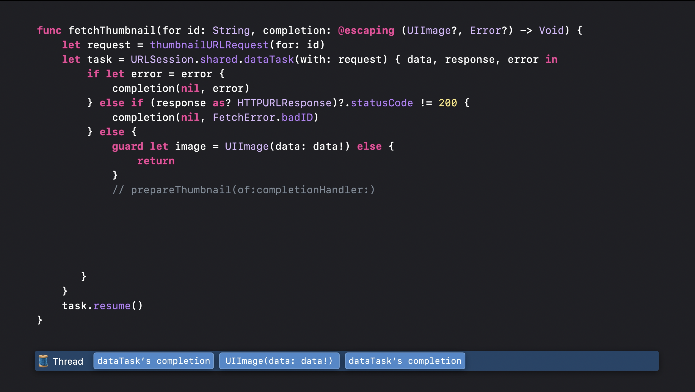
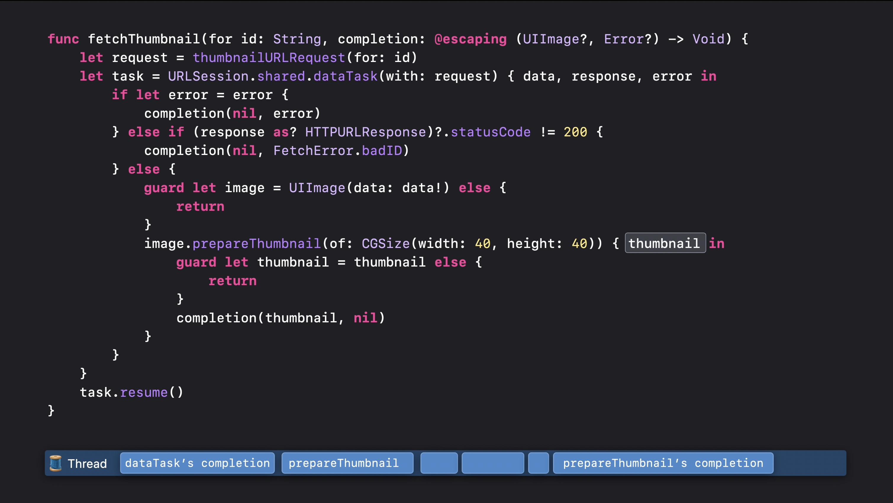

# Async and Sync
- 일반 메서드는 동기적인 성질을, escaping 또는 async await를 활용하면 비동기적 성질로 바뀐다.
<br><br>
## A. 동기


- **결과값 또는 오류를 반환할 떄까지 스레드를 일시적으로 멈춘다.**<br>
즉, 스레드의 권한은 해당 메서드로 넘어가게 된다. 여기서 스레드의 권한을 돌려받기 위해선 해당 메서드가 오류를 뱉거나 결과값을 리턴해야한다.
<br><br>
## B. 비동기


- **해당 작업이 진행하는 동안 스레드의 권한을 메서드가 아닌 시스템으로 넘긴다.** <br>중요한 일을 먼저 처리할 수 있도록 시스템에게 권한을 넘기게 된 것인데, 시스템은 임시 멈춰진 비동기 메서드로 다시 돌아와 실행하게 된다.

### 특징
1. 반복해서 멈출 수 있다. 횟수의 제한이 없기에 계속해서 멈출 수 있게 된다.
2. Async 키워드를 활용했다고 메서드를 비동기적으로 실행하지 않는다. Await 또한 마찬가지
<br><br>
## B.1 비동기 처리 과정
```swift
func fetchTumbnail(for id: String) async throws -> UIImage {
    let request = thumbnailURLRequest(for: id)
    let (data, response) = try await URLSession.shared.data(for: request)
    guard (response as? HTTPURLResponse)?.statusCode == 200 else { throw FetchError.badID}
    let maybbeImage = UIImage(data: data)
    guard let thumbnail = await maybeImage?.thumbnail else { throw FetchError.badImage }
    return thumbnail
}
```


1. fetchThumbnail 메서드 실행<br/>
2. fetchThumbnail 메서드 호출 이후 유저가 데이터에 변화를 주는 행동을 하게 될 경우, URLSession은 임시 정지 되며 데이터 변경 작업을 먼저 실행<br/>
3. 이후 시스템에서 fetchThumbnail 메서드로 돌아가거나 다른 메서드를 실행 - 의도했던 스레드가 아닌 곳에서 실행 가능<br/>

- **따라서 Swift에서는 await 키워드를 활용하도록 권장하는 것.**
[Thread Safety and Async/Await]


<details>
<summary>비동기 실행 이미지</summary>





</details>
<br><br>

## C. 동기 메서드에 비동기 메서드를 담는 방법
```swift
private func fetchData() {
    // Task없이는 비동기처리 작업을 할 수 없다.
    // Task {
        do {
            let pokemonData = try await NetworkManager.shared.fetchPokemon()
            PersistenceManager.shared.savePokeData(pokemonData.id)
            self.pokemonName = pokemonData.name
            self.setImage(with: pokemonData)
        } catch let error {
            if let error = error as? NetworkError {
                print("네트워크 오류가 발생했습니다.")
            } else {
                print("예측 불가능한 에러가 발생했어요.")
            }
        }
    //}
}
```
- **Task라는 비동기 처리에 감싸면 일반 메서드 내부에 비동기 작업을 실행할 수 있게 된다.**<br> 앞서 정리한대로 일반 메서드는 동기적으로(synchronous) 처리를 하기 때문에 비동기 처리(asynchronous)를 하는 fetchPokemon 메서드를 내부에서 실행할 수 없다.

<br><br>
## D. async Alternative && Continuation [🚧 추가 공부 중]
```swift
// 이전 메서드
func getPersistentPosts(completion: @escaping ([Post], Error?) -> Void) {
    do {
        let req = Post.fetchRequest()
        req.sortDescriptors = [ NSSortDescriptor(key: "date"), ascending: true) ]
        let asyncRequest = NSAsynchronousFetchRequest<Post>(fetchRequest: req) { result in
        completion(result.finalResult ?? [], nil)
        }

        try self.managedObjectContext.execute(asyncRequest)
    } catch {
        completion([], error)
    }
}

// async 적용 > continuation
func persistentPost() asycn throws -> [Post] {
    typeAlias PostContinuation = CheckedContinuation<[Post], Error>
    return try await withCheckedThrowingContinuation { (continuation: PostContinuation in
    self.getPersistentPosts { posts, error in
        continuation.resume(throwing: error)
    } else {
        continutation.resume(returning: posts)
    }
    )}
}
```

- 우리는 await를 통해 권한을 시스템으로 넘기고 결과값이 돌아오기를 기다리며 클로저를 통해 어떤 작업이 이뤄져야하는지 알린다. 메서드가 실행된 이후, completion block을 통해 우리는 해당 결과값을 자유롭게 던질 수 있게 되는데 이를 continuation이라 부른다.
- continuation은 한번만 호출되어야 한다.


- 간혹 API 콜 내부의 메서드가 빨리 끝나는 경우가 존재한다. url을 변환하는 과정이나 이미지 데이터를 변환하기만 하는 경우 빨리 처리가 가능한데, 이런 경우는 thread가 백그라운드에서 실행이 되어도 문제가 없다. 반대로 시간이 걸리는 메서드의 경우 - 비동기처리롤 메서드를 실행한다.


<br><br>
## Question
- escaping로 호출하는 URLSession은 동기인가 비동기인가?
- What is considered important?
- 계속해서 딜레이가 발생한다면 계속해서 멈춰질 가능성이 있을까?